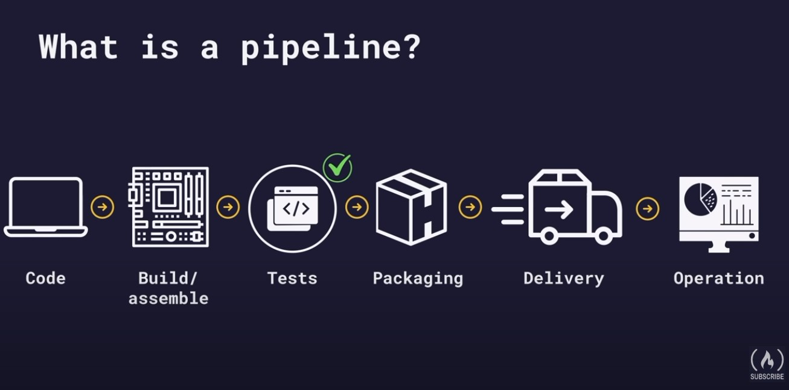

# GitLab CI Course - FreeCodeCamp  

## Links

1. [Classentral](https://www.classcentral.com/classroom/freecodecamp-devops-with-gitlab-ci-course-build-pipelines-and-deploy-to-aws-104862)
2. [DevOps with GitLab CI Course - Build Pipelines and Deploy to AWS - YouTube](https://www.youtube.com/watch?v=PGyhBwLyK2U)
3. [Learn GitLab with tutorials  GitLab](https://docs.gitlab.com/ee/tutorials/)
4. [Run Playwright Tests via GitLab](https://medium.com/@info_70421/running-playwright-tests-via-gitlab-ci-cd-pipeline-572e1d95f6f2)

## Progress  

- [x] ⌨️ Lesson 1 - Welcome (0:00:00​)
- [x] ⌨️ Lesson 2 - Your first GitLab project (0:03:03​)
- [x] ⌨️ Lesson 3 - Your first pipeline (0:13:00​)
- [x] ⌨️ Lesson 4 - Help, my pipeline is not working (0:23:32)
- [x] ⌨️ Lesson 5 - What is YAML? (0:26:22)
- [x] ⌨️ Lesson 6 - What is a shell? (0:35:12)
- [x] ⌨️ Lesson 7 - GitLab architecture (0:37:50)
- [x] ⌨️ Lesson 8 - Pipeline stages (0:43:14)

## Lesson 2 - Your first GitLab project (0:03:03​)

1. Create GitLab account
2. Create private project
3. Change settings > Preferences  > Syntax highlighting > Monokai
4. On: Render whitespace characters in the web IDE
5. Create new file `.gitlab-ci.yml`
6. Go to Build > Pipelines > Run pipeline
7. Check pipeline logs

Push an existing Git repository

```bash
cd existing_repo
git remote add origin https://gitlab.com/mzn2/gitlabci.git
git branch -M main
git push -uf origin main

```

```yml
test:
    script: echo "Hello world"

```

## Lesson 3 - Your first pipeline (0:13:00​)



1. Add commands to write text file
2. By default pipeline uses Ruby Docker image
3. Add alternative Docker image - Linux `alpine`
4. Commit changes
5. Check pipeline logs

```yml
build laptop:
    image: alpine
    script: 
        - echo "Building laptop"
        - mkdir build
        - touch build/$BUILD_FILE_NAME
        - echo "Mainboard" >> build/$BUILD_FILE_NAME
        - cat build/$BUILD_FILE_NAME
        - echo "Keyboard" >> build/$BUILD_FILE_NAME
        - cat build/$BUILD_FILE_NAME
```  

Output

```bash
Running with gitlab-runner 16.6.0~beta.105.gd2263193 (d2263193)
  on blue-2.saas-linux-small-amd64.runners-manager.gitlab.com/default XxUrkriX, system ID: s_f46a988edce4
  feature flags: FF_USE_IMPROVED_URL_MASKING:true
Resolving secrets
00:00
Preparing the "docker+machine" executor
00:05
Using Docker executor with image alpine ...
Pulling docker image alpine ...
Using docker image sha256:f8c20f8bbcb684055b4fea470fdd169c86e87786940b3262335b12ec3adef418 for alpine with digest alpine@sha256:51b67269f354137895d43f3b3d810bfacd3945438e94dc5ac55fdac340352f48 ...
Preparing environment
00:01
Running on runner-xxurkrix-project-53471482-concurrent-0 via runner-xxurkrix-s-l-s-amd64-1704186592-2d594c12...
Getting source from Git repository
00:01
Fetching changes with git depth set to 20...
Initialized empty Git repository in /builds/mzn2/gitlabci/.git/
Created fresh repository.
Checking out 341525e5 as detached HEAD (ref is main)...
Skipping Git submodules setup
$ git remote set-url origin "${CI_REPOSITORY_URL}"
Executing "step_script" stage of the job script
00:00
Using docker image sha256:f8c20f8bbcb684055b4fea470fdd169c86e87786940b3262335b12ec3adef418 for alpine with digest alpine@sha256:51b67269f354137895d43f3b3d810bfacd3945438e94dc5ac55fdac340352f48 ...
$ echo "Building laptop"
Building laptop
$ mkdir build
$ touch build/$BUILD_FILE_NAME
$ echo "Mainboard" >> build/$BUILD_FILE_NAME
$ cat build/$BUILD_FILE_NAME
Mainboard
$ echo "Keyboard" >> build/$BUILD_FILE_NAME
$ cat build/$BUILD_FILE_NAME
Mainboard
Keyboard
Cleaning up project directory and file based variables
00:01
Job succeeded
```

## Lesson 4 - Help, my pipeline is not working

1. Missing colon after job in yml file
2. Missing space between dash and command
3. Incorrect levele indentation (dfault 4 spaces )

## Lesson 5 - What is YAML

yaml example

```yml
person:
    name: John
    age: 23

    hobbies:
        - sports
        - YouTube
        - hiking
    address: 
        street: 123 Mayfield Ave.
    experience:
        - title: Junior Dev
          period: 2000-2005
        - title: Senior Dev 
          period: since 2005
```

It is important to use defined keywords and definitions.

## Lesson 7 - GitLab architecture


GitLab runner has relatively simple installation.
Can be run even on laptop.

- GitLab project > Settings > Runners  

Shared runners are shared between all GitLab users. F

## Lesson 8 - Pipeline stages  

```yaml
variables:
  ENV: 'dev'

stages:
  - setup
  - test

setup data: 
  stage: setup
  script:
    - echo "Run script from setup"

run_playwright_smoke_tests:
  stage: test
  image: mcr.microsoft.com/playwright:v1.41.1-jammy
  script:
    - echo "Run script with $ENV environment from test stage"

```

## Lesson 9 - Why do pipelines fail?

Pipeline failed:
Exit code - 1  

Try to check the last command executing before fail occured. 
What is the Docker image used?

##  Lesson 10 - Job artifacts

Job artifacts allow sharing outputs between different jobs in pipeline. For example files. 

Use `artifacts` and `paths` to create artifact so that it can be used in other pipeline jobs.


```yaml
build laptop:
    ...
    artifacts:
        paths:
            - build


```


```yaml
stages:
    - build
    - test

build laptop:
    image: alpine
    stage: build
    script: 
        - echo "Building a laptop"
        - mkdir build
        - touch build/$BUILD_FILE_NAME
        - echo "Mainboard" >> build/$BUILD_FILE_NAME
        - cat build/$BUILD_FILE_NAME
        - echo "Keyboard" >> build/$BUILD_FILE_NAME
    artifacts:
        paths:
            - build

test laptop:
    image: alpine
    stage: test
    script:
        - test -f build/$BUILD_FILE_NAME
```


## Lesson 11 - Testing the build

Use `grep` to test contents of the file contain expected word so that this can be used to verify that code change does not break functionality.


```yaml

   - grep "Display" build/$BUILD_FILE_NAME

````

##  Lesson 12 - Variables

Use `variables` as a global variable to specify file name so that file name can be changed in one place only  and take effect in multiple parts of pipeline.


```yaml
stages:
    - build
    - test
variables:
  BUILD_FILE_NAME: laptop.txt

build laptop:
    image: alpine
    stage: build
    script: 
        - echo "Building a laptop"
        - mkdir build
        - touch build/$BUILD_FILE_NAME
        - echo "Mainboard" >> build/$BUILD_FILE_NAME
        - cat build/$BUILD_FILE_NAME
        - echo "Keyboard" >> build/$BUILD_FILE_NAME
    artifacts:
        paths:
            - build

test laptop:
    image: alpine
    stage: test
    script:
        - test -f build/$BUILD_FILE_NAME
```


## Setting env variables in CI pipeline and using in Playwright tests  

```yaml
variables:
  ENV: 'basewcdev'
  CI: 'true'

```

playwright.config.ts

```json
  {
    video: retain-on-failure,
    headless: process.env.CI === 'true' ? true : false,
  }

```
